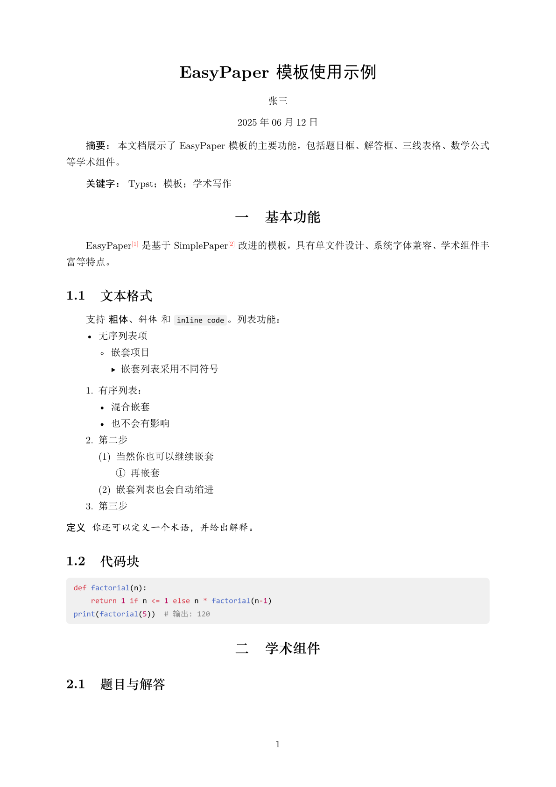
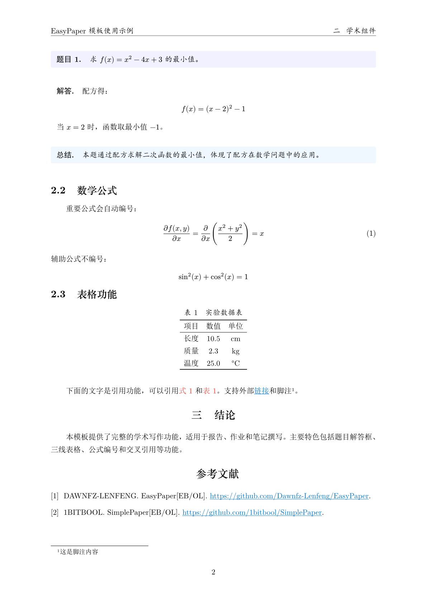

# EasyPaper

一个基于 [SimplePaper](https://github.com/jinhao-huang/SimplePaper) 改进的 Typst 模板，可用于日常报告/作业等。只需一个文件，无需外置库，使用 Windows 系统内置字体，即可开始创作。

## 快速开始

将 `template.typ` 文件复制到你的项目根目录。新建 `.typ` 文件，导入模板：

```typst
#import "/template.typ": *
#show: project.with(
  title: "文档标题",
  author: "作者姓名",
  date: auto,
  abstract: [
    摘要内容...
  ],
  keywords: ("关键词1", "关键词2")
)

= 第一章 引言

这里是正文内容...

== 子标题

更多内容...
```

## 使用说明

### 学术组件

在原有模板的基础上，一共有以下学术组件，以供基本日常笔记使用。

**题目框：**
```typst
#problem[
  计算 $f(x) = x^2$ 的导数。
]
```

**解答框：**
```typst
#solution[
  $f'(x) = 2x$
]
```

**三线表格：**
```typst
#show table: three-line-table // 启用三线表格样式

// 然后正常使用 table 即可
#figure(
  table(
      columns: 3,
      [项目], [数值], [单位],
      [长度], [10], [cm],
      [质量], [5], [kg],
  ),
  caption: [测量数据]
)
```

### 数学公式

模板对数学公式编号进行了优化，带标签的公式会自动编号，不带标签的公式不会编号。

```typst
// 行内公式
这是 $E = mc^2$ 公式。

// 带编号的公式
$ x = frac(-b plus.minus sqrt(b^2 - 4ac), 2a) $ <eq:quadratic>

// 不编号的公式
$ sum_(i=1)^n i = frac(n(n+1), 2) $
```

同时有一些自定义函数，如偏微分（后续可能会添加更多）：

```typst
// 偏微分
$ frac(partial f, partial x) = pardiff(f, x) $
```

### 字体说明

目前默认字体为：

- 中文：SimSun, STZhongsong, KaiTi, SimHei
- 英文：New Computer Modern, Times New Roman, Consolas

Windows 大部分字体已内置，macOS/Linux 可能需要额外安装中文字体。

如需使用其他字体，请修改模板中的字体配置。

### 自定义设置

模板中提供了一些自定义设置，如字体、字号、段间距等。可根据需求自行修改 `template.typ` 中 `config` 配置。


## 效果展示




## 致谢

本模板基于 [jinhao-huang/SimplePaper](https://github.com/jinhao-huang/SimplePaper) 改进，感谢原作者。
